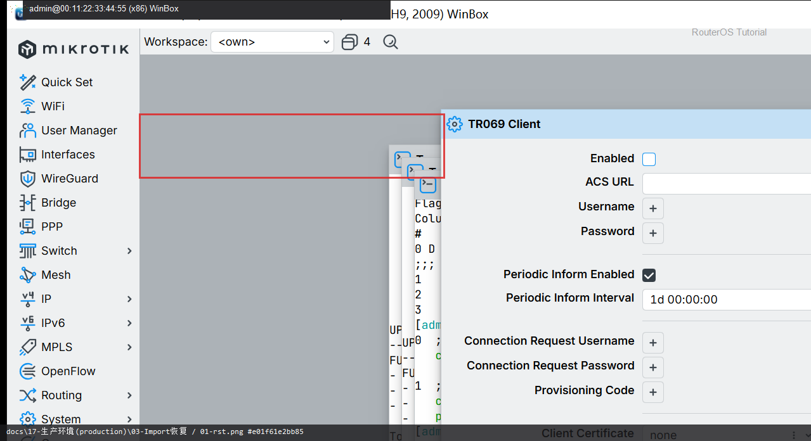
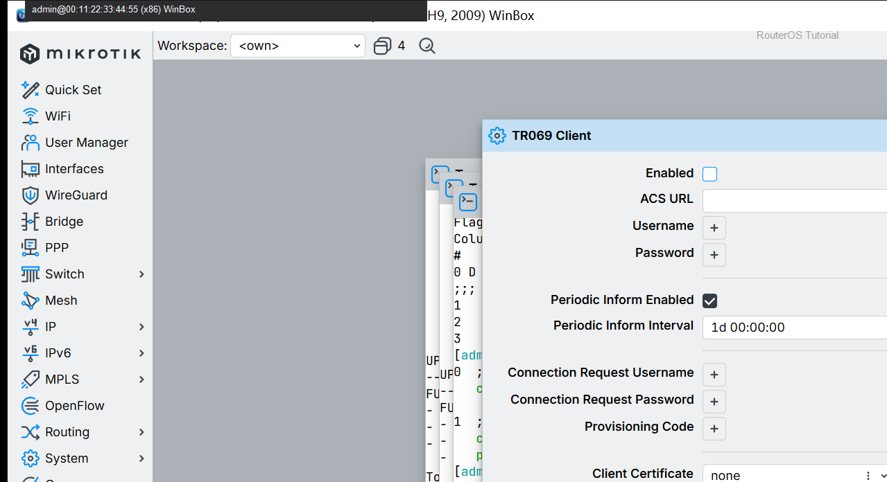

# Import 恢复

> 适用版本：RouterOS 7.x  
> 管理工具：WinBox  
> 官方依据：[Import](https://help.mikrotik.com/docs/spaces/ROS/pages/8978443/Configuration+Management)

## 目的

用 export 文本恢复配置。

## 网络

- 示例 LAN：`192.168.88.0/24`，网关 `192.168.88.1`，接口 `bridge`（改成你的口）
- WAN 示例：`pppoe-out1` 或 `ether1`
- 密码示例：`********`（填你自己的管理员密码）
- 身份示例：`R1`

## 第1步：上传 rsc

WinBox：`Files`

动作：把 lab-export.rsc 拖进 Files。



```routeros
/file/print where name~"rsc"
```

## 第2步：Import

WinBox：`New Terminal`

动作：/import file-name=lab-export.rsc



```routeros
/import file-name=lab-export.rsc
```

## 检查

WinBox：配置按脚本恢复

```routeros
/import file-name=lab-export.rsc
```

## 常见问题

导入前先备份当前状态。
