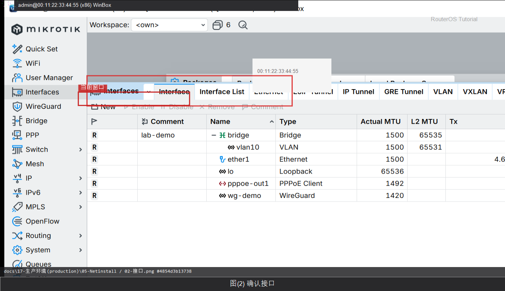

# Netinstall

> 适用版本：RouterOS 7.x

## 目的

系统损坏时用 Netinstall 重装（电脑侧工具）。

## 网络

- 示例 LAN：`192.168.88.0/24`，网关 `192.168.88.1`，接口 `bridge`（改成你的口）
- WAN 示例：`pppoe-out1` 或 `ether1`
- 密码示例：`********`（填你自己的管理员密码）
- 身份示例：`R1`

## 第1步：核对当前版本

WinBox：`System → Packages`

动作：记下架构与版本，准备对应包。


```routeros
/system/resource/print
/system/package/print
```

## 第2步：确认接口

WinBox：`Interfaces`

动作：Netinstall 需要直连网口，先认清 ether 编号。



```routeros
/interface/print
```

## 检查

WinBox：知道架构与直连口

```routeros
/system/resource/print
```
