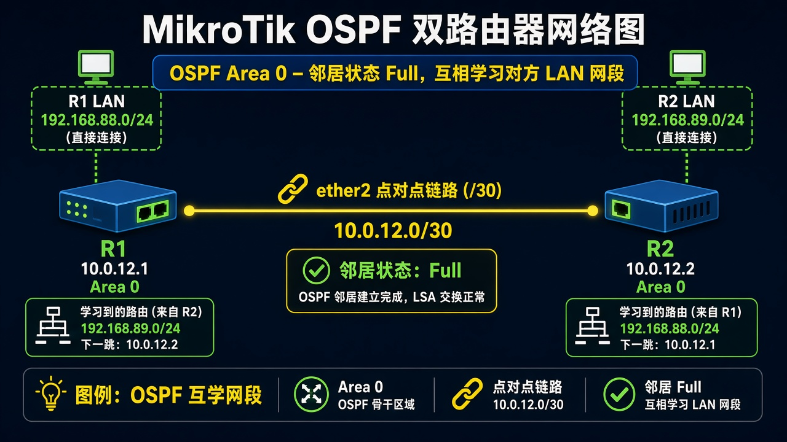

# OSPF 互通

> 适用版本：RouterOS 7.x

## 目的

两台 RouterOS 用 OSPF 互学网段。

## 网络

- 示例 LAN：`192.168.88.0/24`，网关 `192.168.88.1`，接口 `bridge`（改成你的口）
- WAN 示例：`pppoe-out1` 或 `ether1`
- 密码示例：`********`（填你自己的管理员密码）
- 身份示例：`R1`

- 互联：R1 `10.0.12.1/30`、R2 `10.0.12.2/30`，口 `ether2`
- R1 LAN：`192.168.88.0/24`；R2 LAN：`192.168.89.0/24`
- Router ID：R1 `10.10.10.1`，R2 `10.10.10.2`

## 网络拓扑及原理图

两边在 Area 0 建邻接，把对方 LAN 学进路由表。



<p align="center">图(1) OSPF</p>

## 第1步：建 Instance 和 Area

WinBox：`Routing → OSPF`

动作：Instance：Name=`ospf-lab`，Version=`2`，Router ID=`10.10.10.1`。Area：Name=`backbone`，Area ID=`0.0.0.0`，Instance=`ospf-lab`。R2 把 Router ID 改成 `10.10.10.2`。


<p align="center">图(2) Instance和Area</p>

```routeros
/routing/ospf/instance/add name=ospf-lab version=2 router-id=10.10.10.1
/routing/ospf/area/add name=backbone area-id=0.0.0.0 instance=ospf-lab
```

## 第2步：套接口模板

WinBox：`Routing → OSPF → Interface Templates → +`

动作：Area=`backbone`，Interfaces 填 `ether2` 和 `bridge`（有 LAN 的那口）。R2 同样做。


<p align="center">图(3) 接口模板</p>

```routeros
/routing/ospf/interface-template/add area=backbone interfaces=ether2,bridge
```

## 检查

WinBox：Neighbors 状态 Full；Routes 里出现对方 LAN

```routeros
/routing/ospf/neighbor/print
/ip/route/print where ospf
```

## 常见问题

邻接起不来：两端 Area ID、网段掩码要一致，ether2 要能 ping 通。v7 没有 `/routing ospf network`，用 interface-template。
