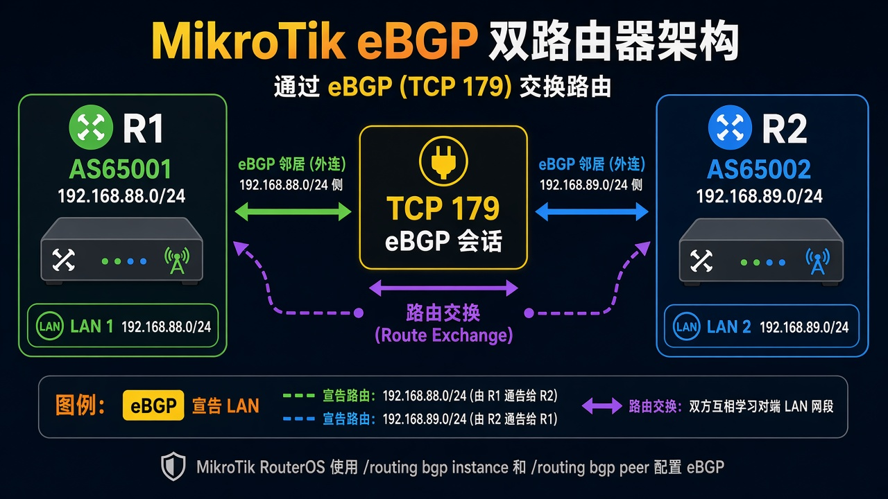

# BGP 互通

> 适用版本：RouterOS 7.x

## 目的

两台之间建一条 eBGP，把各自 LAN 宣告过去。

## 网络

- 示例 LAN：`192.168.88.0/24`，网关 `192.168.88.1`，接口 `bridge`（改成你的口）
- WAN 示例：`pppoe-out1` 或 `ether1`
- 密码示例：`********`（填你自己的管理员密码）
- 身份示例：`R1`

- 互联：R1 `10.0.12.1/30` AS `65001`；R2 `10.0.12.2/30` AS `65002`
- 宣告：R1 `192.168.88.0/24`，R2 `192.168.89.0/24`

## 先看懂

eBGP 建好后，对方网段出现在 IP 路由里。



<p align="center">图(1) BGP</p>

## 第1步：准备要宣告的网段

WinBox：`IP → Firewall → Address Lists → +；IP → Routes → +`

动作：List=`bgp-networks`，Address=`192.168.88.0/24`。再加一条同网段 blackhole。R2 改成 `192.168.89.0/24`。


<p align="center">图(2) 宣告网段</p>

```routeros
/ip/firewall/address-list/add list=bgp-networks address=192.168.88.0/24
/ip/route/add dst-address=192.168.88.0/24 blackhole comment=lab-bgp-net
```

## 第2步：加 BGP 连接

WinBox：`Routing → BGP → Connections → +`

动作：Name=`to-r2`，Remote Address=`10.0.12.2`，Remote AS=`65002`，Local Role=`ebgp`，AS=`65001`，Output Network=`bgp-networks`。R2 对调地址和 AS。


<p align="center">图(3) BGP连接</p>

```routeros
/routing/bgp/connection/add name=to-r2 remote.address=10.0.12.2 remote.as=65002 local.role=ebgp as=65001 output.network=bgp-networks
```

## 检查

WinBox：BGP Sessions 为 established；路由表有对方 LAN

```routeros
/routing/bgp/session/print
/ip/route/print where bgp
```

## 常见问题

建不上：TCP 179 要通，Role 必须填。v7 没有 `/routing bgp peer`。
