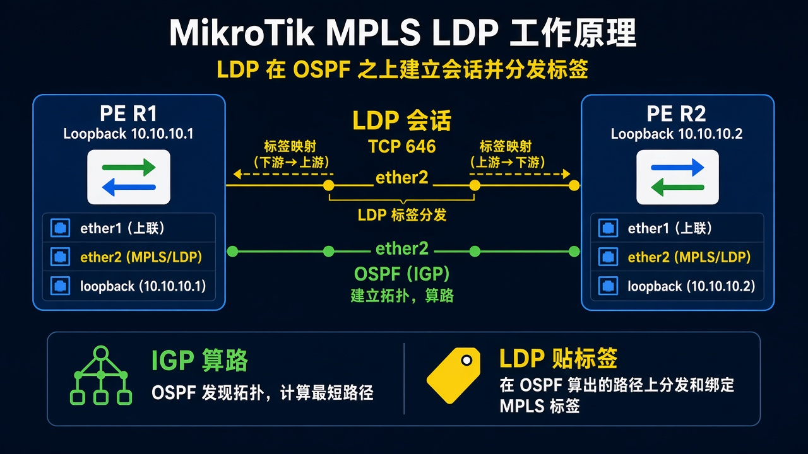

# LDP 互通

> 适用版本：RouterOS 7.x

## 目的

先有 IGP，再在互联口开 LDP，看到邻居和标签。

## 网络

- 示例 LAN：`192.168.88.0/24`，网关 `192.168.88.1`，接口 `bridge`（改成你的口）
- WAN 示例：`pppoe-out1` 或 `ether1`
- 密码示例：`********`（填你自己的管理员密码）
- 身份示例：`R1`

- 先按 [OSPF 互通](../../18-动态路由(dynamic-routing)/01-OSPF互通/01-OSPF互通.md) 把邻接跑 Full
- 环回：R1 `10.10.10.1/32`，R2 `10.10.10.2/32`
- LDP 只开在互连口 `ether2`，不要开在用户口

## 先看懂

OSPF 把路算出来，LDP 给这条路贴标签。



<p align="center">图(1) LDP</p>

## 第1步：加环回

WinBox：`IP → Addresses → +`

动作：Address=`10.10.10.1/32`，Interface 用 loopback（没有就用 `bridge`）。R2 用 `.2`。


<p align="center">图(2) 环回地址</p>

```routeros
/ip/address/add address=10.10.10.1/32 interface=bridge comment=lab-lsr
```

## 第2步：开 LDP

WinBox：`MPLS → LDP → +；再 LDP Interface → +`

动作：AFI=`ip`，LSR ID=`10.10.10.1`，Transport Addresses=`10.10.10.1`。Interface 选 `ether2`。R2 改成 `.2`。


<p align="center">图(3) LDP</p>

```routeros
/mpls/ldp/add afi=ip lsr-id=10.10.10.1 transport-addresses=10.10.10.1
/mpls/ldp/interface/add interface=ether2
```

## 检查

WinBox：LDP Neighbors 有对端；Forwarding 里能看到标签

```routeros
/mpls/ldp/neighbor/print
/mpls/forwarding-table/print
```

## 常见问题

没有邻居：先 ping 通 LSR ID，OSPF 要把 `10.10.10.2/32` 学过来。
