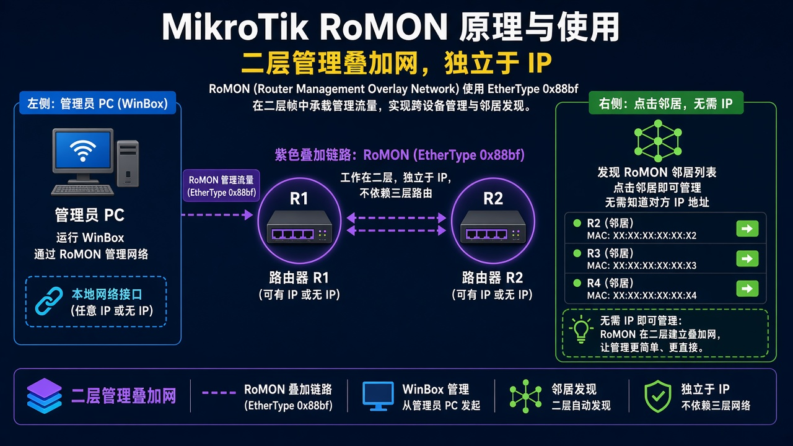
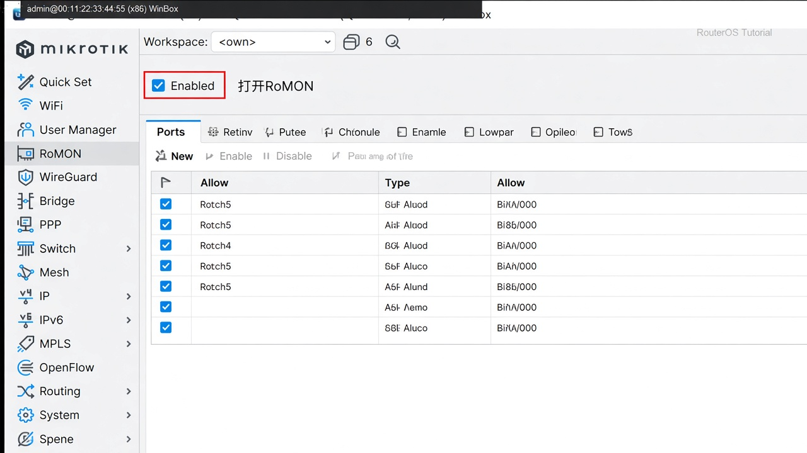

# RoMON

> 适用版本：RouterOS 7.x

## 目的

二层找不到 IP 时，仍能用 WinBox 点到邻台。

## 网络

- 示例 LAN：`192.168.88.0/24`，网关 `192.168.88.1`，接口 `bridge`（改成你的口）
- WAN 示例：`pppoe-out1` 或 `ether1`
- 密码示例：`********`（填你自己的管理员密码）
- 身份示例：`R1`

RoMON 走独立 MAC 封装，不靠你现有的 IP/VLAN 转发。

## 先看懂

管理机经过 R1 还能点到 R2。



<p align="center">图(1) RoMON</p>

## 第1步：打开 RoMON

WinBox：`Tools → RoMON`

动作：Enabled 勾上。


<p align="center">图(2) 打开RoMON</p>

```routeros
/tool/romon/set enabled=yes
```

## 第2步：口是否参加

WinBox：`Tools → RoMON → Ports`

动作：默认 `all` 允许。不想让 WAN 口参加：加一条 ether1，Forbid。



<p align="center">图(3) RoMON端口</p>

```routeros
/tool/romon/port/print
```

## 检查

WinBox：WinBox Neighbors 能看到带 RoMON 的邻台，能点进去

```routeros
/tool/romon/set enabled=yes
/tool/romon/port/print
```

## 常见问题

交换机芯片口不通时，换有线口试。
