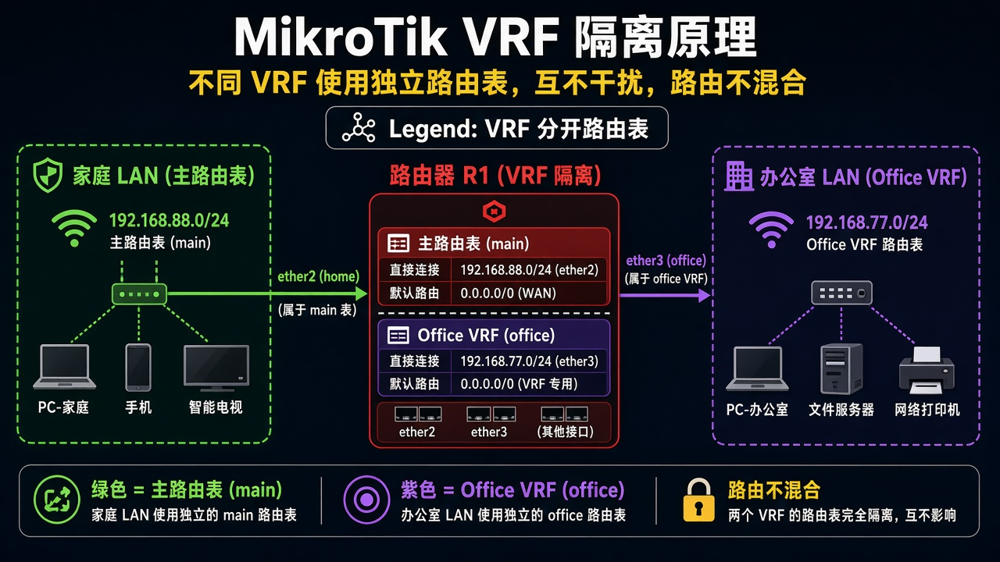

# 第 53 章：让两套网在同一台路由器上互不串

> 适用版本：RouterOS 7.x

## 目的

把一组口放进独立路由表，和家里网错开。

## 网络

- 示例 LAN：`192.168.88.0/24`，网关 `192.168.88.1`，接口 `bridge`（改成你的口）
- WAN 示例：`pppoe-out1` 或 `ether1`
- 密码示例：`********`（填你自己的管理员密码）
- 身份示例：`R1`

office 口示例：`ether3`，地址 `192.168.77.1/24`。VRF 名字 `office`。

## 网络拓扑及原理图

ether3 的路由只在 office 表里，不和 `192.168.88.0/24` 混。



<p align="center">图(1) VRF</p>

## 第1步：建 VRF

WinBox：`IP → VRF → +`

动作：Name=`office`，Interfaces 勾 `ether3`。这条要排在系统 `main` 上面。


<p align="center">图(2) 建VRF</p>

```routeros
/ip/vrf/add name=office interfaces=ether3
```

## 第2步：给 office 配地址

WinBox：`IP → Addresses → +`

动作：Address=`192.168.77.1/24`，Interface=`ether3`。


<p align="center">图(3) VRF地址</p>

```routeros
/ip/address/add address=192.168.77.1/24 interface=ether3 comment=lab-vrf
```

## 检查

WinBox：Routes 能切到 `office` 表，看到 `192.168.77.0/24`

```routeros
/ip/vrf/print
/ip/route/print where routing-table=office
```

## 常见问题

口加不进 VRF：把 `office` 挪到 `main` 上面。防火墙从 7.14 起匹配 VRF 虚接口名。
