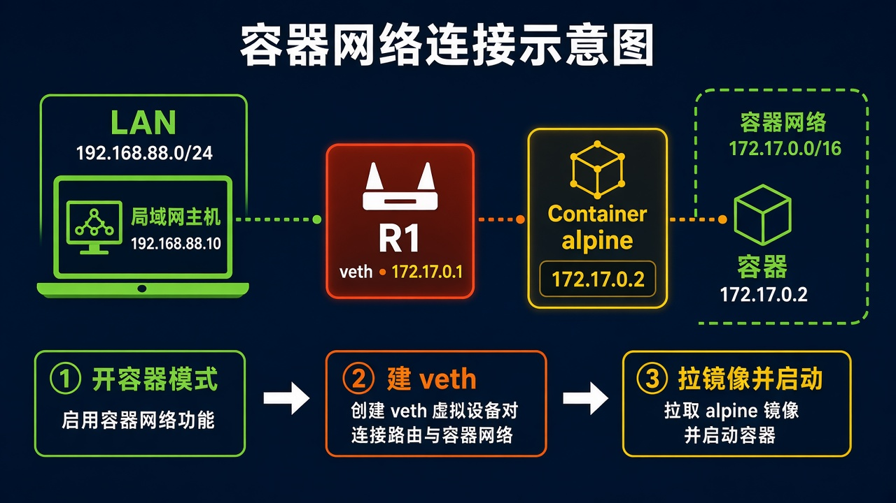
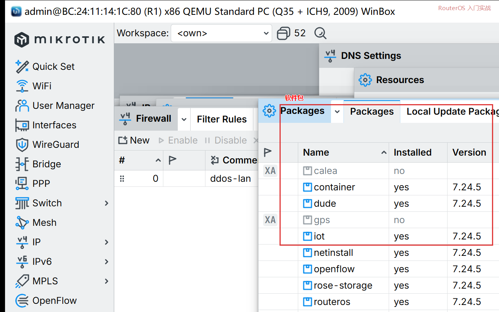
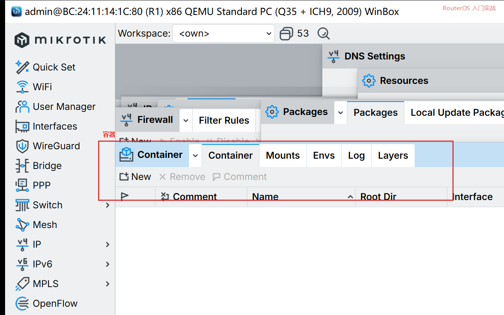

# 第 61 章：让 RouterOS 跑起一个小容器

> 适用版本：RouterOS 7.x

## 目的

打开容器模式，建一个 veth，拉一个很小的镜像并启动。RouterOS 的容器不是在本机再装一套 Docker Engine。

x86、ARM、ARM64 才能用。磁盘要留出镜像空间。打开容器模式需要能碰到设备电源：改完要冷启动。

## 网络

- 容器网：veth `veth1`，路由器 `172.17.0.1/24`，容器 `172.17.0.2/24`
- 镜像示例：`alpine:latest`（仓库地址按你填的 registry）
- 身份示例：`R1`

## 网络拓扑及原理图

容器走 veth 到 R1，再由 R1 NAT 上网。



<p align="center">图(1) 容器</p>

## 第1步：确认软件包

WinBox：`System → Packages`

动作：列表里要有 `container`。没有就到 [MikroTik 下载页](https://mikrotik.com/download) 取和当前版本同一套 extra packages，上传后再 reboot。



<p align="center">图(2) 软件包</p>

```routeros
/system/package/print where name=container
```

## 第2步：打开容器模式

WinBox：`System → Device Mode` 或用终端。

动作：把 container 打开。x86 虚拟机要在宿主机上关掉再打开电源，只点 Reboot 往往不够。

```routeros
/system/device-mode/update container=yes
/system/device-mode/print
```

改完冷启动。再看 `container: yes` 才继续。

## 第3步：建 veth 和地址

WinBox：`Interfaces → VETH → +`

动作：Name=`veth1`。Address=`172.17.0.2/24`，Gateway=`172.17.0.1`。再给 R1 加 `172.17.0.1/24` 在 `veth1` 上。

```routeros
/interface/veth/add name=veth1 address=172.17.0.2/24 gateway=172.17.0.1
/ip/address/add address=172.17.0.1/24 interface=veth1 comment=container
```

## 第4步：NAT 和转发

WinBox：`IP → Firewall → NAT → +`

动作：Chain=`srcnat`，Src. Address=`172.17.0.0/24`，Action=`masquerade`。Filter 的 forward 放行 `veth1`。

```routeros
/ip/firewall/nat/add chain=srcnat src-address=172.17.0.0/24 action=masquerade comment=container
/ip/firewall/filter/add chain=forward in-interface=veth1 action=accept comment=container-fwd
/ip/firewall/filter/add chain=forward out-interface=veth1 action=accept comment=container-fwd
```

## 第5步：登记镜像源并添加容器

WinBox：`Container → Config` 填 Registry URL，常见是 `https://lscr.io/`。`Container → +`，Interface=`veth1`，Remote Image=`alpine:latest`，Root Dir 指到有空间的盘，Logging 勾上。Start。



<p align="center">图(3) 容器</p>

```routeros
/container/config/set registry-url=https://lscr.io/ tmpdir=disk1/pull
/container/add remote-image=alpine:latest interface=veth1 root-dir=disk1/alpine logging=yes
/container/start [find]
```

tmpdir、root-dir 改成你磁盘上的目录。没有空盘就不要硬拉大镜像。

## 检查

`Container` 列表 Status 为 running。终端可以：

```routeros
/container/print
/system/device-mode/print
```

device-mode 仍是 `container: no` 时，镜像加不进去。磁盘只剩一百多 MB 时，不要拉 Pi-hole 这类大镜像。

## 常见问题

冷启动没做，container 还是 no。Registry 填错或磁盘写不下，Status 会停在 extract / error，看 Log。
