# PPPoE 拨号上网

> 官方依据（RouterOS 7）：
> [First Time Configuration](https://help.mikrotik.com/docs/spaces/ROS/pages/328151/First+Time+Configuration) ·
> [PPPoE](https://help.mikrotik.com/docs/spaces/ROS/pages/2031625/PPPoE) ·
> [DNS](https://help.mikrotik.com/docs/spaces/ROS/pages/37748767/DNS) ·
> [NAT](https://help.mikrotik.com/docs/spaces/ROS/pages/3211299/NAT)
>
> 对照环境：Winbox 3 · 命令行 New Terminal / SSH

运营商给的是 **用户名 + 密码**（光纤/部分 DSL），而不是 DHCP 自动拿地址时，用本课。

本课假设：

- WAN 网线插在 **`ether1`**（请改成你的实际上网口）
- `ether1` **不要**加入 LAN 网桥（拨号口必须是独立二层口）
- 账号示例写成 `ISP_USER` / `ISP_PASS`，换成运营商给你的账号
- 拨号成功后，**真正的公网口是 `pppoe-out1`，不是 `ether1`**（官方原文如此）
- LAN 仍用官方默认网段思路：`192.168.88.0/24` 在 `bridge` 上（本课不重复加 LAN 地址）

## 本课会做到

路由器拨上 PPPoE、有默认路由和 DNS；内网电脑经过 **masquerade** 共享上网。

---

### 步骤 1：确认上网口独立且已连接

**官方依据：** [PPPoE](https://help.mikrotik.com/docs/spaces/ROS/pages/2031625/PPPoE)（client 跑在任意二层以太网口上）；[First Time Configuration](https://help.mikrotik.com/docs/spaces/ROS/pages/328151/First+Time+Configuration)（WAN 用 `ether1` 作示例）

**这一步要完成：** `ether1` 为 Running，且 **不是** bridge 的 slave。

**命令行**

在 Terminal 执行（可整段复制）：

```routeros
/interface/print
/interface/bridge/port/print
```

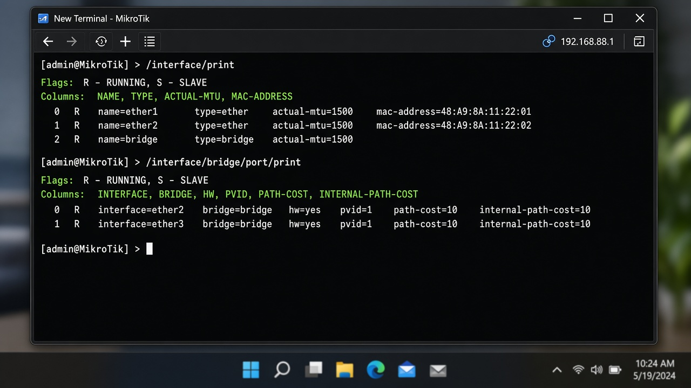

**Winbox**

路径：`Interfaces`

看 `ether1` 的 Running 为是。再打开 `Bridge` → `Ports`：表里 **不能** 有 `ether1`。若有，选中该行点 `-` 移出网桥，再继续。

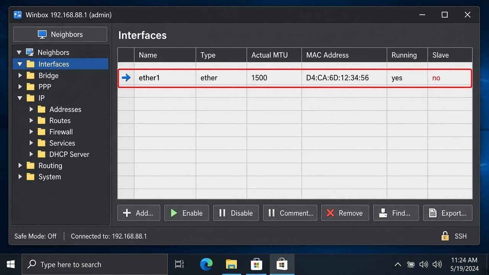

**怎么确认成功：** `print` 里 `ether1` 带 `R`；bridge port 列表不含 `ether1`。

**常见失败：** 光猫 LAN 没插到你选的口；`ether1` 还在网桥里，拨号会不稳定或失败。官方还建议：**不要在同一接口上同时跑 DHCP/静态 IP 和 PPPoE**。

---

### 步骤 2：添加 PPPoE 客户端

**官方依据：** [First Time Configuration · PPPoE Connection](https://help.mikrotik.com/docs/spaces/ROS/pages/328151/First+Time+Configuration)；属性说明见 [PPPoE Client](https://help.mikrotik.com/docs/spaces/ROS/pages/2031625/PPPoE)

**这一步要完成：** 出现接口 `pppoe-out1`，并开始拨号。

官方示例要点：`interface=ether1`、`user`/`password`、`add-default-route=yes`、`use-peer-dns=yes`、`disabled=no`。`service-name` 仅当运营商要求时再填，默认可留空（连广播域内任意 AC）。

**命令行**

```routeros
/interface/pppoe-client/add name=pppoe-out1 interface=ether1 user=ISP_USER password=ISP_PASS add-default-route=yes use-peer-dns=yes disabled=no
/interface/pppoe-client/print
```

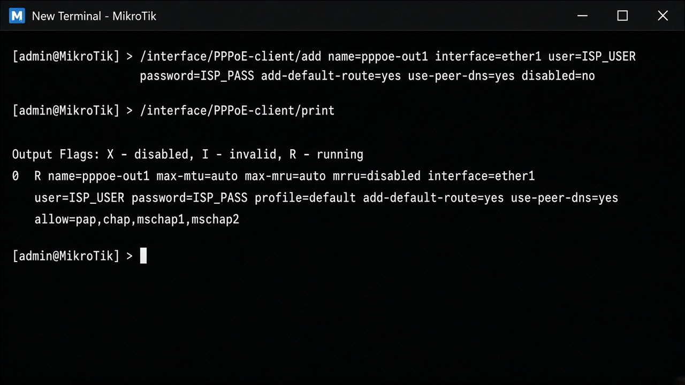

**Winbox**

路径：`PPP` → 页签 `Interfaces` → 工具栏 `+` → 选 `PPPoE Client`

- `General`：`Name` = `pppoe-out1`，`Interface` = `ether1`
- `Dial Out`：`User` / `Password` 填运营商账号；勾选 **Add Default Route**、**Use Peer DNS**
- 点 `OK`（不要勾 `Disabled`）

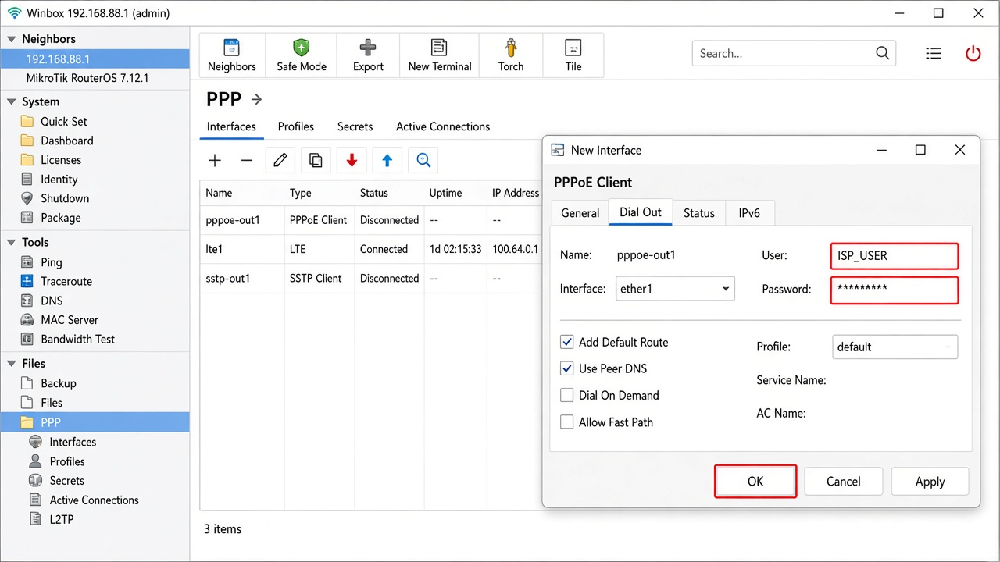

**怎么确认成功：** `print` 有一行 `name="pppoe-out1"`，且不是 `X`（disabled）。

**常见失败：** 用户名密码抄错（含后缀 `@163.gd` 一类要整串填）；`Interface` 选成了 `bridge`；忘了点 `OK`。

---

### 步骤 3：确认会话已连通并拿到地址

**官方依据：** [PPPoE · Status](https://help.mikrotik.com/docs/spaces/ROS/pages/2031625/PPPoE)（`/interface pppoe-client monitor`）

**这一步要完成：** 状态为 `connected`，并看到 `local-address`（本端 IP）。

**命令行**

```routeros
/interface/pppoe-client/monitor pppoe-out1 once
```

`status` 常见值：`dialing`、`verifying password...`、`connected`、`disconnected`。

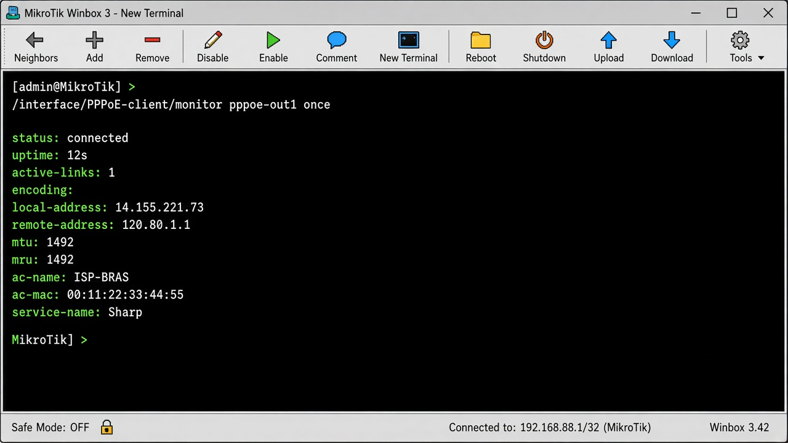

**Winbox**

路径：`PPP` → `Interfaces` → 双击 `pppoe-out1` → 看 `Status`

应看到 `connected`、本端/对端地址、uptime。列表里该行通常带 Running（`R`）。

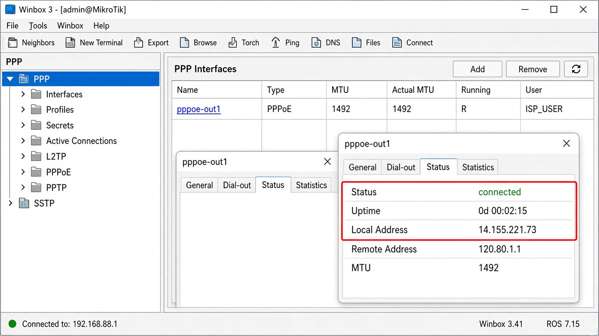

**怎么确认成功：** `status: connected`，`local-address` 非空。

**常见失败：** 一直 `dialing`：网线/VLAN/光猫桥接模式不对；停在校验密码：账号错。运营商若要求 `service-name`，在客户端补上该字段后再拨。

---

### 步骤 4：确认默认路由走拨号口

**官方依据：** [PPPoE](https://help.mikrotik.com/docs/spaces/ROS/pages/2031625/PPPoE) 属性 `add-default-route`；[First Time Configuration](https://help.mikrotik.com/docs/spaces/ROS/pages/328151/First+Time+Configuration)（此后 WAN 是 `pppoe-out1`）

**这一步要完成：** 有一条活动的 `0.0.0.0/0`，网关接口为 `pppoe-out1`。

**命令行**

```routeros
/ip/route/print
```

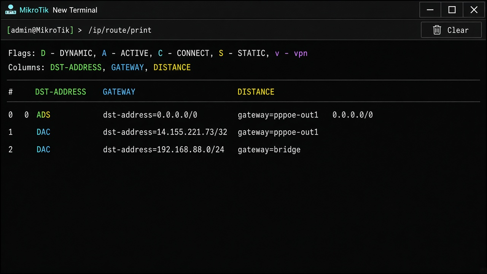

**Winbox**

路径：`IP` → `Routes`

找到 `Dst. Address` = `0.0.0.0/0`，`Gateway` 为 `pppoe-out1`，且为 Active。

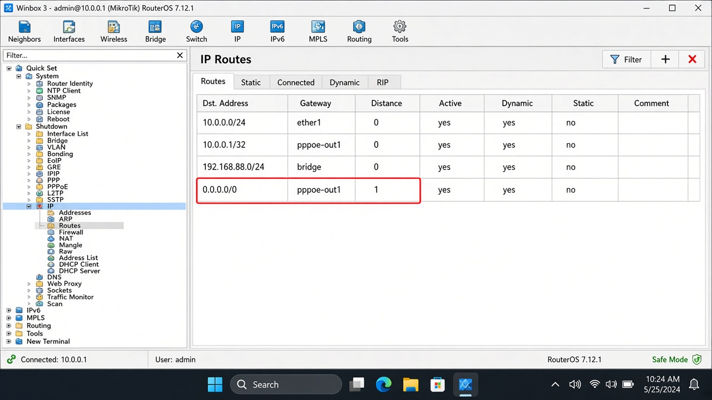

**怎么确认成功：** 默认路由 Active，出口不是 `ether1`。

**常见失败：** 创建客户端时没勾 Add Default Route；另有一条静态默认路由 distance 更小，把 PPPoE 路由盖掉。

---

### 步骤 5：确认运营商 DNS，并允许内网查询

**官方依据：** [PPPoE](https://help.mikrotik.com/docs/spaces/ROS/pages/2031625/PPPoE) 的 `use-peer-dns`；[DNS](https://help.mikrotik.com/docs/spaces/ROS/pages/37748767/DNS) 的 `allow-remote-requests`

**这一步要完成：** `dynamic-servers` 已有运营商 DNS；路由器可作为内网 DNS 缓存。

官方说明：`allow-remote-requests=yes` 后，路由器在 TCP/UDP 53 上应答查询；**必须用防火墙把 53 限制在可信网段**，否则可能被拿去打开放解析。本课只打开开关，防火墙细则见后续课程。

**命令行**

```routeros
/ip/dns/print
/ip/dns/set allow-remote-requests=yes
/ip/dns/print
```

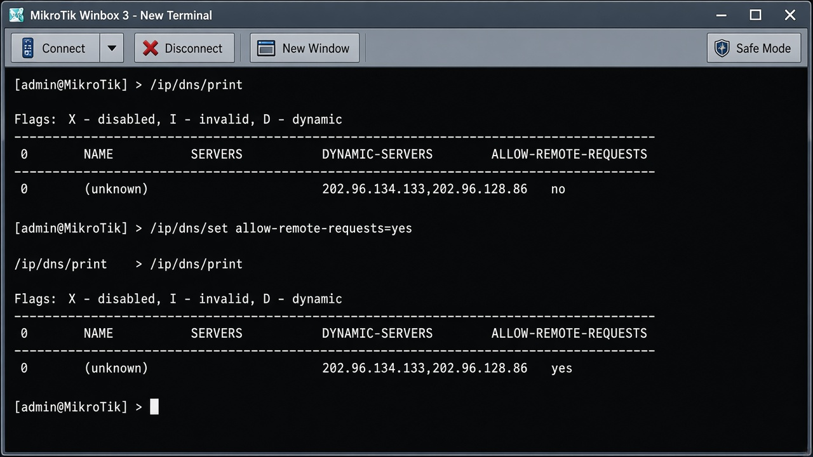

**Winbox**

路径：`IP` → `DNS`

看 **Dynamic Servers** 是否已有地址；勾选 **Allow Remote Requests** → `Apply`。

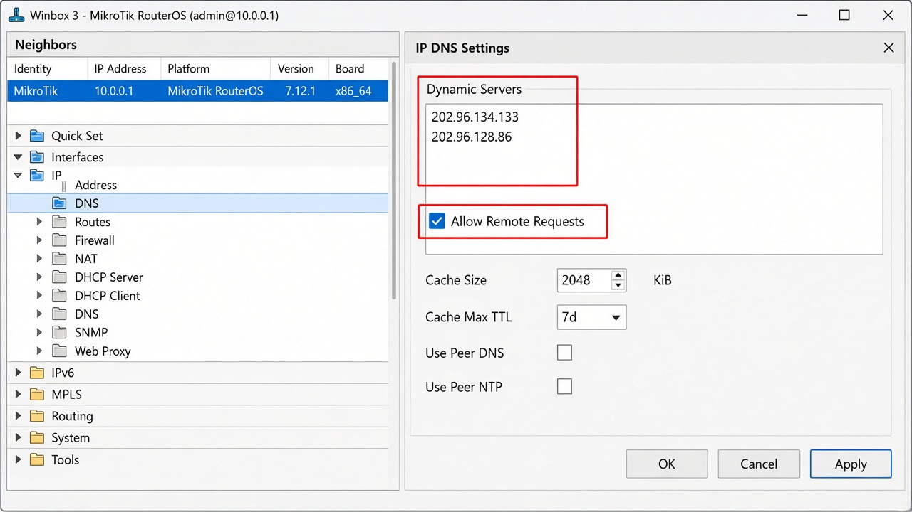

**怎么确认成功：** `dynamic-servers` 非空；`allow-remote-requests: yes`。

**常见失败：** 没勾 Use Peer DNS，则没有动态 DNS；只开远程查询却不限制 53，有安全风险。

---

### 步骤 6：在拨号口做 masquerade

**官方依据：** [First Time Configuration · NAT](https://help.mikrotik.com/docs/spaces/ROS/pages/328151/First+Time+Configuration)；[NAT · Masquerade](https://help.mikrotik.com/docs/spaces/ROS/pages/3211299/NAT)

**这一步要完成：** 内网源地址在出 `pppoe-out1` 时改写成拨号得到的公网/WAN IP。

官方写明：公网口若是 PPPoE，NAT 的 `out-interface` **必须用该 PPPoE 接口**，不要再用 `ether1`。`masquerade` 适合 PPPoE 重拨后地址会变的场景。

**命令行**

```routeros
/ip/firewall/nat/add chain=srcnat action=masquerade out-interface=pppoe-out1 comment=masquerade-wan
/ip/firewall/nat/print
```

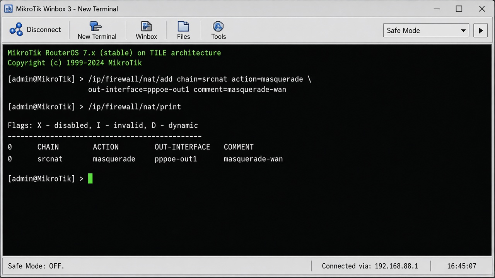

**Winbox**

路径：`IP` → `Firewall` → 页签 `NAT` → `+`

- `Chain`：`srcnat`
- `Action`：`masquerade`
- `Out. Interface`：`pppoe-out1`
- `Comment`：`masquerade-wan`
- 点 `OK`

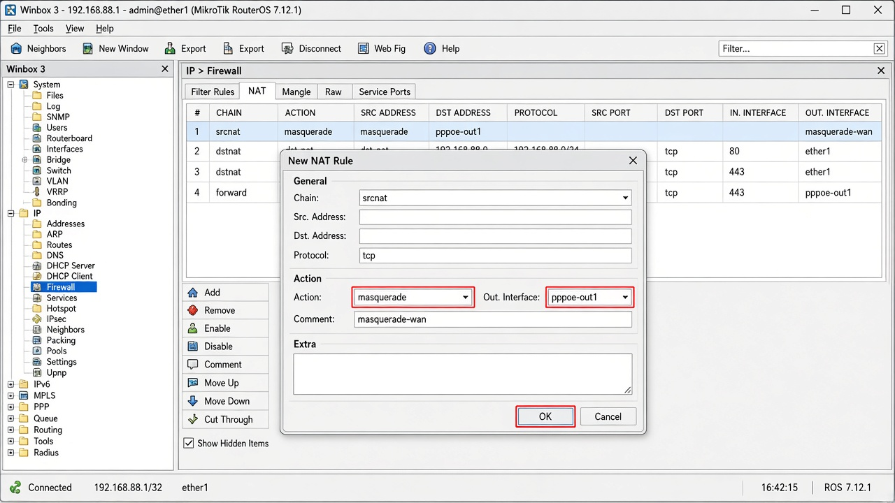

**怎么确认成功：** NAT 表有一条 `srcnat` + `masquerade` + `out-interface=pppoe-out1`。

**常见失败：** `Out. Interface` 仍填 `ether1`，路由器自己能上网、电脑不能；链写成 `dstnat`。

---

### 步骤 7：从路由器探测连通

**官方依据：** [First Time Configuration](https://help.mikrotik.com/docs/spaces/ROS/pages/328151/First+Time+Configuration)（配置完成后 ping 已知地址，例如公共 DNS，再验证 DNS）

**这一步要完成：** 路由器能 ping 通 IP，且能按名字解析。

**命令行**

```routeros
/ping 8.8.8.8 count=4
/ping www.google.com count=4
```

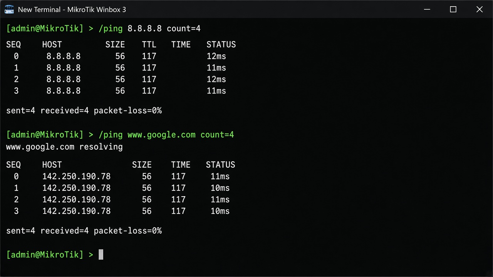

**Winbox**

路径：工具栏 `Tools` → `Ping`（或菜单 `Tools` → `Ping`）

`Ping To` 填 `8.8.8.8`，点 `Start`。丢包应为 0 或接近 0。再 ping `www.google.com` 验证 DNS。

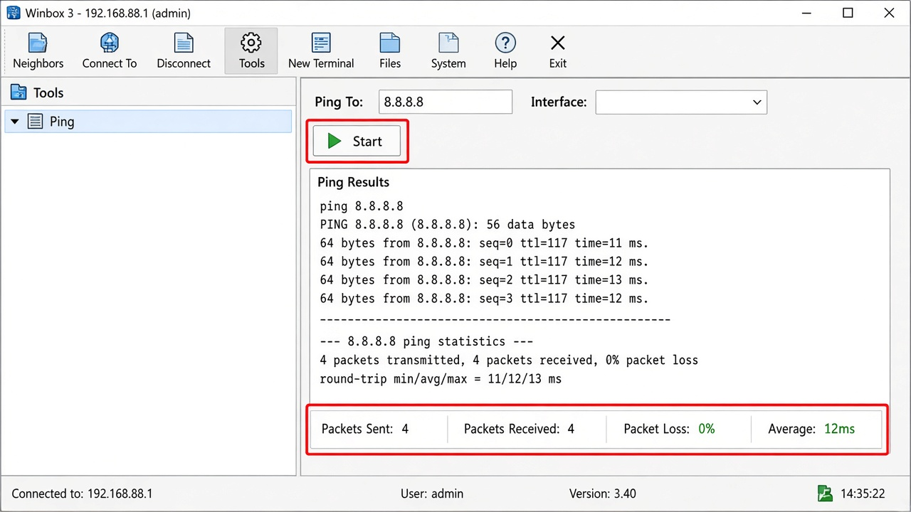

**怎么确认成功：** IP ping 通；域名也能通。电脑网关指向路由器 LAN 地址后，应能打开网页。

**常见失败：** 只有 IP 通、域名不通 → 回到步骤 5；路由器通、电脑不通 → 检查 LAN 地址/DHCP 与步骤 6 的 `out-interface`。

---

## 本课命令合集

把 `ISP_USER` / `ISP_PASS` / `ether1` 换成你的值：

```routeros
/interface/print
/interface/bridge/port/print
/interface/pppoe-client/add name=pppoe-out1 interface=ether1 user=ISP_USER password=ISP_PASS add-default-route=yes use-peer-dns=yes disabled=no
/interface/pppoe-client/print
/interface/pppoe-client/monitor pppoe-out1 once
/ip/route/print
/ip/dns/print
/ip/dns/set allow-remote-requests=yes
/ip/firewall/nat/add chain=srcnat action=masquerade out-interface=pppoe-out1 comment=masquerade-wan
/ip/firewall/nat/print
/ping 8.8.8.8 count=4
/ping www.google.com count=4
```

## 官方链接

- [First Time Configuration](https://help.mikrotik.com/docs/spaces/ROS/pages/328151/First+Time+Configuration)
- [PPPoE](https://help.mikrotik.com/docs/spaces/ROS/pages/2031625/PPPoE)
- [DNS](https://help.mikrotik.com/docs/spaces/ROS/pages/37748767/DNS)
- [NAT](https://help.mikrotik.com/docs/spaces/ROS/pages/3211299/NAT)
